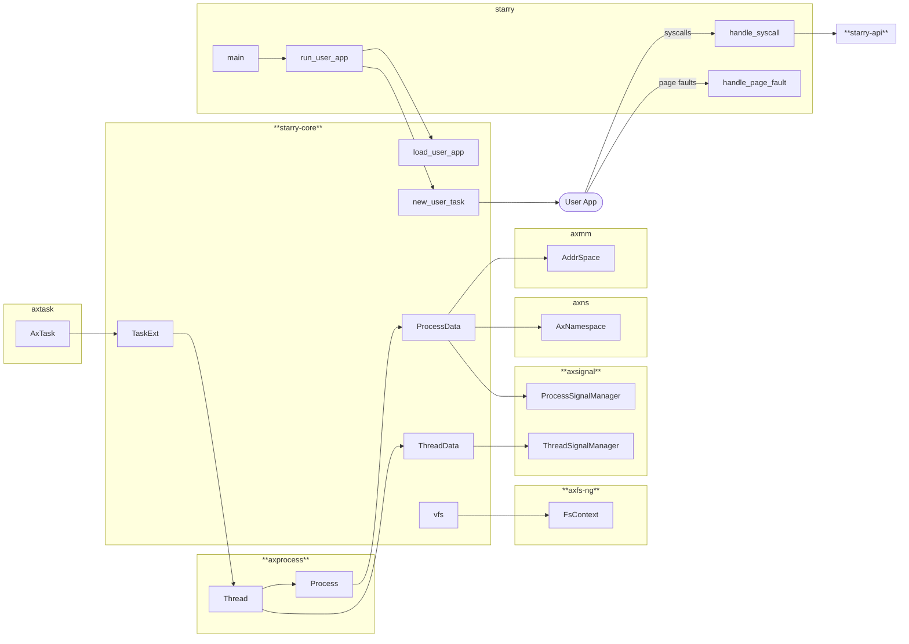
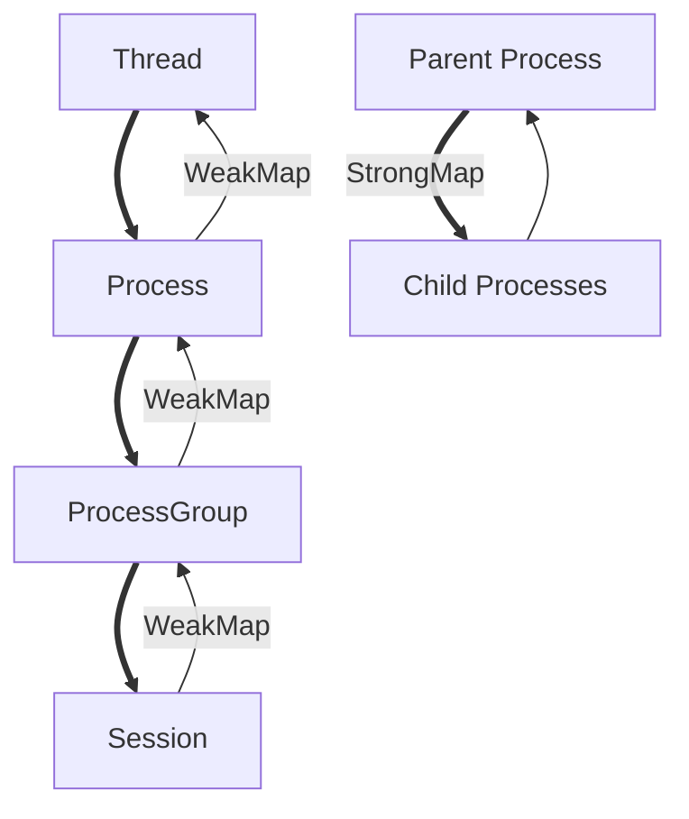

# 大实验总结报告

## 1. 总体架构设计



## 2. 添加/扩展/创新设计实现

### [weak-map](https://github.com/Starry-OS/weak-map)

#### 设计

- 当弱引用指向的值被回收（失效）时，能自动清理对应的键值对。
- 提供一个类似于标准库 BTreeMap 的接口，但针对弱引用的特性做了适配。
- 提供高效迭代和访问策略，避免对已失效数据的访问。
- 统计操作次数，达到阈值后批量清理过期元素，不破坏所有权，避免频繁清理带来的性能开销。

#### 核心实现代码

```rust
#[derive(Default)]
struct OpsCounter(AtomicUsize);

const OPS_THRESHOLD: usize = 1000;

/// A B-Tree map that stores weak references to values.
#[derive(Clone)]
pub struct WeakMap<K, V> {
    inner: btree_map::BTreeMap<K, V>,
    ops: OpsCounter,
}

impl<K, V> WeakMap<K, V>
where
    K: Ord,
    V: WeakRef,
{
    #[inline]
    fn try_bump(&mut self) {
        self.ops.bump();
        if self.ops.reach_threshold() {
            self.cleanup();
        }
    }

    /// Returns a reference to the value corresponding to the key.
    ///
    /// The key may be any borrowed form of the map's key type, but the ordering
    /// on the borrowed form *must* match the ordering on the key type.
    pub fn get<Q>(&self, key: &Q) -> Option<V::Strong>
    where
        K: Borrow<Q>,
        Q: Ord + ?Sized,
    {
        self.ops.bump();
        self.inner.get(key).and_then(V::upgrade)
    }

    /// Returns `true` if the map contains a value for the specified key.
    ///
    /// The key may be any borrowed form of the map's key type, but the ordering
    /// on the borrowed form *must* match the ordering on the key type.
    pub fn contains_key<Q>(&self, key: &Q) -> bool
    where
        K: Borrow<Q>,
        Q: Ord + ?Sized,
    {
        self.ops.bump();
        self.inner.get(key).is_some_and(|v| !v.is_expired())
    }
}

impl<'a, K, V> Iterator for Iter<'a, K, V>
where
    V: WeakRef,
{
    type Item = (&'a K, V::Strong);

    fn next(&mut self) -> Option<Self::Item> {
        for (key, value) in self.0.by_ref() {
            if let Some(value) = value.upgrade() {
                return Some((key, value));
            }
        }
        None
    }
}
```

#### 示例

```rust
let threads = WeakMap::new();

{
    let thread = Arc::new(Thread::new());
    threads.insert(0, &thread); // no ownership transfer

    threads.get(&0); // type: Option<Arc<Thread>>
    // thread drop here
}

threads.len(); // 0
```

对比普通的 BTreeMap：

```rust
let threads = BTreeMap::new();

{
    let thread = Arc::new(Thread::new());
    threads.insert(0, Arc::downgrade(thread));

    threads.get(&0); // type: Option<&Weak<Thread>>
    // thread drop here
}

threads.len(); // 1
```

### [#[extern_trait]](https://github.com/AsakuraMizu/extern-trait)

#### 设计

通过过程宏（proc-macro）为 trait 生成不透明代理类型，以便将 trait 的方法调用转发到外部实现。

基本上就是 [`crate_interface`](https://github.com/arceos-org/crate_interface) 的升级版。

#### 示例与实现原理

在定义 crate：
```rust
#[extern_trait(pub(crate) HelloProxy)]
pub unsafe trait Hello {
    fn new(num: i32) -> Self;
    fn hello(&self);
}

let v = HelloProxy::new(42);
v.hello();
```

在实现 crate：
```rust
struct HelloImpl(i32);

#[extern_trait]
unsafe impl Hello for HelloImpl {
    fn new(num: i32) -> Self {
        Self(num)
    }

    fn hello(&self) {
        println!("Hello, {}", self.0)
    }
}
```

展开的代码（节选）：

```rust
unsafe impl Hello for HelloProxy {
    fn new(_0: i32) -> Self {
        unsafe extern "Rust" {
            #[link_name = "__extern_trait_A_0.1.0_A_Hello_new"]
            safe fn new(_: i32) -> HelloProxy;
        }
        new(_0)
    }
    // ...
}

const _: () = {
    #[doc(hidden)]
    #[unsafe(export_name = "__extern_trait_A_0.1.0_A_Hello_new")]
    unsafe extern "Rust" fn new(_0: i32) -> HelloImpl {
        <HelloImpl as Hello>::new(_0)
    }
    // ...
}
```

### [axprocess](https://github.com/Starry-OS/axprocess)

[文档](https://starry-os.github.io/axprocess/axprocess/index.html)

#### 设计


以及比 Process 更小的单元 Thread

#### 实现

引用关系（`Arc`/`Weak`）



动态数据

```rust
pub struct Thread {
    data: Box<dyn Any + Send + Sync>,
    // ...
}

pub struct Process {
    data: Box<dyn Any + Send + Sync>,
    // ...
}
```

### 对 ArceOS 的改进

1. 改进硬件抽象层 axhal
   1. 修复 LA64 保存内核栈位置的问题 [oscomp/arceos#18](https://github.com/oscomp/arceos/pull/18)
   2. 为 `TrapFrame` 提供更多接口 [oscomp/arceos#29](https://github.com/oscomp/arceos/pull/29)
   3. 统一了不同平台上系统调用前后程序计数器自增的行为 [oscomp/arceos#35](https://github.com/oscomp/arceos/pull/35)
   4. 在 x86-64 和 aarch64 上实现了内核态与用户态的 thread local 寄存器隔离 [oscomp/arceos#35](https://github.com/oscomp/arceos/pull/35)
2. 改进内存管理模块 axmm
   1. 修复错误的页表查询结果 [page_table_multiarch#17](https://github.com/arceos-org/page_table_multiarch/pull/17)
   2. 修复地址空间克隆行为 [oscomp/arceos#4](https://github.com/oscomp/arceos/pull/4) [oscomp/arceos#11](https://github.com/oscomp/arceos/pull/11)
3. 其他
   1. 同步原语模块 axsync 引入 lock_api，增加更多功能，允许在独立内核组件 crate 中通过 trait 的方式使用同步原语 [oscomp/arceos#33](https://github.com/oscomp/arceos/pull/33)
   2. 改进 IO 性能 [axio#1](https://github.com/arceos-org/axio/pull/1)
   3. 改进资源命名空间 [oscomp/arceos#30](https://github.com/oscomp/arceos/pull/30) [oscomp/arceos#38](https://github.com/oscomp/arceos/pull/38)

### 对 Starry OS 的改进

1. 改进项目结构
   1. 分割成一个 workspace 里的三个 crate [oscomp/starry-next#22](https://github.com/oscomp/starry-next/pull/22)
   2. 移除 arceos_posix_api 依赖（设计上主要是为了与 axlibc 库对接） [oscomp/starry-next#47](https://github.com/oscomp/starry-next/pull/47)
2. 用户程序启动
   1. execve 支持参数和环境变量 [oscomp/starry-next#11](https://github.com/oscomp/starry-next/pull/11)
   2. 进程、线程 [oscomp/starry-next#34](https://github.com/oscomp/starry-next/pull/34)
   3. 解析测例命令行参数 [oscomp/starry-next#44](https://github.com/oscomp/starry-next/pull/44)
   4. 修复 execve 内存泄漏 [oscomp/starry-next#51](https://github.com/oscomp/starry-next/pull/51)
   5. 运行初始化脚本

## 3. 开发过程

由于我在开发过程中基本上都以合并进入 oscomp 分支仓库为目标，开发过程时间线基本上可以参考 PR 顺序，这里是链接：
- https://github.com/oscomp/arceos/issues?q=sort%3Aupdated-desc+author%3AAsakuraMizu
- https://github.com/oscomp/starry-next/issues?q=sort%3Aupdated-desc+author%3AAsakuraMizu

所以这里只说一些比较“印象深刻”的事情。

1. 我在很早的时候（3月中旬）就意识到并提出来 `arceos_posix_api` 并不适合我们直接使用，它的设计是为了和 `axlibc` 对接，结果就是指针满天飞，很多问题也没有考虑到。  
   很快就做了第一版重构的 draft pr，但是当时还有很多更急于解决的问题，而且重构的也不是很理想，最后在三月底只合并了把 Starry 拆分成三个 crate 的 PR  
   后来我们专注于在自己的分支上推进工作，这个 pr 就被遗忘了，直到后来合并进程功能的时候被意外关掉了。  
   最终在五月中旬的时候，我再次整理代码并重新提起了这个 PR，这件事才算告一段落。
2. 很早就有同学遇到了 TLS 寄存器相关的问题，但是最初只是以“能用就行”为目标实现了一个非常奇怪的 fix，并且还需要特判平台。  
   我最初也不知道原因，也解释不了为什么只有部分平台上需要这个修复。  
   但是后来我通过进一步调查知道了这里的差异是由不同平台里 thread local 相关寄存器的地位不同，进而发现其实 ArceOS 里在这一块儿实现的问题很大。具体的技术细节可以看上面列过的 PR。  
   但是总之为了调查和修复这个问题花了不少功夫。
3. 做这个 `#[extern_trait]` 其实是我第一次写过程宏，花了不少功夫学习这个东西。最后写出来的代码感觉还有很多不满意的地方。  
   并且这个东西涉及到不同平台的 abi 问题，我本来了解的也不多，一开始只考虑了几个简单的 64 位架构（rv64，la64，aarch64，还没考虑x86-64，毕竟它不简单），但是写了单元测试之后，通过 cross 跑了一下，意外地发现大部分平台都能通过测试。

## 4. 分析&比较 oskernel2024-minotauros

总体上的区别：
1. minotauros 的内核部分是单一 crate，而 starry-next 是模块化开发
2. minotauros 只支持 riscv64，starry-next 同时考虑多种架构的支持

实现上的区别：
1. minotauros 的任务调度是通过无栈协程的方式，直接使用 Rust 的 `async`/`Future` 等语言特性
   - 好处是受到编译器的原生支持，切换任务不需要手写汇编代码，可以依靠 Rust 较为成熟的异步生态保证正确性，而且无栈协程开销也更小一些
   - 坏处是因为 Rust 的 async 具有传染性，需要把调用链上所有的函数都改成异步的，编写代码的难度会上升
   - 由于 virtio-drivers 和 lwext4 这些底层的设备操作库不支持异步，导致读写文件系统这一主要性能瓶颈还是阻塞执行的，不能完全发挥异步的优势
   - ArceOS 使用的是有栈协程
3. minotauros 基于 Rust 异步生态中的 `async_task` 实现任务调度，实现简单；ArceOS 有比较复杂的调度算法
4. minotauros 的一些系统调用例如 `wait4` `ppoll` 也是异步函数，一个好处是可以自然地使用 Rust 异步特性中的 Waker 机制实现等待特定事件唤醒，另一个好处是可以方便地实现发生信号时打断系统调用的功能，只需要一边 poll syscall 一边检查是否有事件发生即可

功能上的区别：
1. minotauros 实现了解析设备树，ArceOS 是在编译时硬编码的
2. minotauros 实现了挂载命名空间，有非常完善的 procfs
3. minotauros 加载用户程序的 interpreter 是通过把 interpreter 也加载到内存里并修改程序入口进行的，starry-next 目前的办法是重写调用参数进行的，这实际上导致一些问题，例如 `ld-linux` 如果只传一个文件名它是不会在当前路径下寻找文件的

一些共通的设计：
1. 线程保存进程的强引用 `Arc<Process>`，线程组是弱引用列表 `BTreeMap<Pid, Weak<Thread>>`，用于满足自动释放资源的需要。
