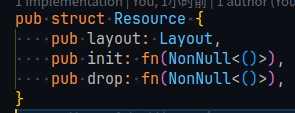
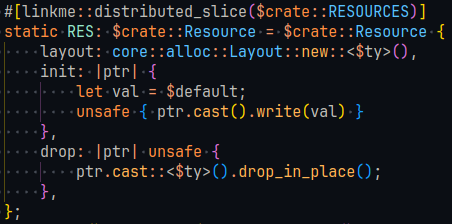
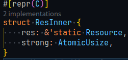
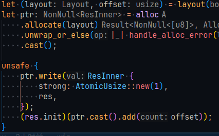
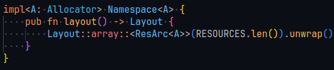

# Week9 4.17

## Done

- 合并了 [starry-next#34](https://github.com/oscomp/starry-next/pull/34) 初步的进程/线程支持，比起之前新增了 settid 和 cleartid 的支持
- 给 [axprocess](https://starry-os.github.io/axprocess/axprocess/index.html) 添加了单元测试和文档的 CI

## WIP

- 实现了 aarch64 上的用户态 tls 隔离，x86 因为不是很熟悉体系结构暂时搁置
- 重构命名空间模块 axns （独立模块）
- 初步调研了支持并发的 lwext4，实际上锁不是在 lwext4 里实现的，需要上层调用者提供锁的实现，如果要兼容需要修改不少东西  
  考虑 https://github.com/yuoo655/ext4_rs ?

## Plan

- 重新开一个 [starry-next#18](https://github.com/oscomp/starry-next/pull/18)，合并进程的 pr 的时候不小心关掉了
- 继续调查 tls 的问题，完成了之后可以跟修程序计数器的问题提一个 pr
- 完成 axns 重构

## axns

资源类型定义：  

由宏生成：  

引用计数：  

内存分配：  

命名空间：  

